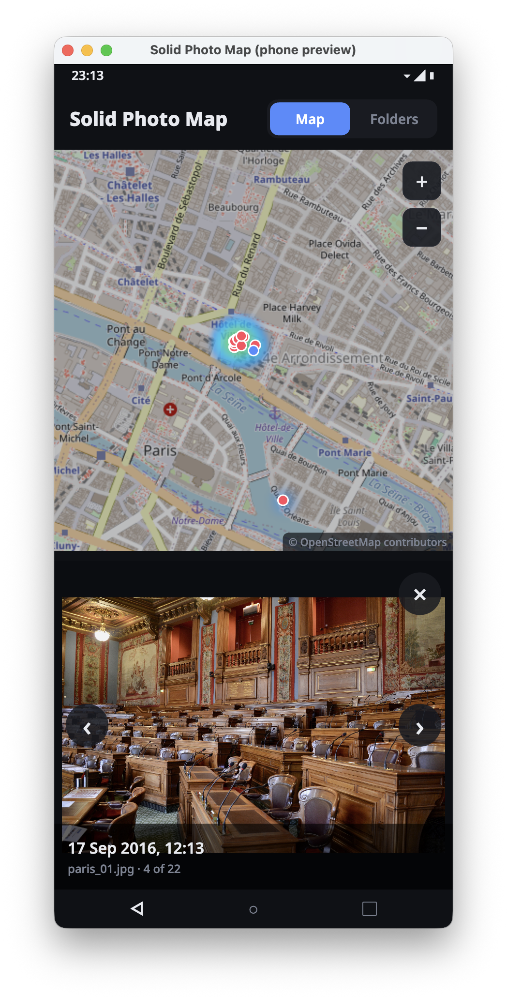

# Solid Photo Map

A heatmap of where your photos were taken, built with [SolidRT](https://github.com/wellawaretech/solidrt). It runs as a desktop window and as an Android app.



<sub>Screenshot: map data © OpenStreetMap contributors. Photo: "Conseil de Paris" by Zigsfy, <a href="https://commons.wikimedia.org/wiki/File:Conseil_de_Paris.JPG">Wikimedia Commons</a>, CC BY-SA 3.0.</sub>

- Pick the folders your photos are in (Folders tab: one-tap suggestions or a folder browser). Every start, and **Scan now**, re-walks them and reads the EXIF block of new or changed files only.
- The GPS position and capture time come from EXIF in JPEG, HEIC/HEIF, AVIF, TIFF and the TIFF-based raw formats (DNG, CR2, NEF, ARW, ORF, RW2, PEF, SRW). Videos are not read yet.
- The index lives in a local SQLite database (`photos.db`) in the app's own private storage folder. Photos and their locations never leave the device.
- The map background is [OpenStreetMap](https://www.openstreetmap.org/copyright)'s own tile server, run by the non-profit OpenStreetMap Foundation: no account, no API key, no ads or tracking. Tiles are cached on the device after the first download, so the server only sees an area the first time you look at it. Switch the background **Off** in the Folders tab for no network use at all (the heatmap is then drawn on a plain grid).
- Drag to pan; pinch, scroll or double-click (double-tap) to zoom, or use the +/− buttons.
- Beside the map (below it on a tall screen) a grid shows the photos taken in the area on screen, newest first. From zoom level 13 the photos also appear as points on the map. Tap a point or a grid photo to open it in the grid's place, so the map stays in view; opening one from the grid (or stepping with ‹ › or the arrow keys) moves the map to where it was taken. Pinch, scroll or double-click inside a photo to zoom it, drag to look around; × or Escape closes it.
- Thumbnails are the small JPEG cameras embed in EXIF where there is one, else the photo shrunk; they are cached in the app's storage. HEIC and raw files without an embedded JPEG thumbnail show as a blank tile for now.

## Run on the desktop

```sh
bun install
bun run dev
```

On macOS the Photos library (`~/Pictures/Photos Library.photoslibrary`) is protected by the system: the app reports it as "not allowed to open". Export photos to a normal folder, or give the app (while developing: the terminal running `srt`) Full Disk Access.

## Phone preview on the desktop

With `bun run dev` running, open a second window shaped like a phone:

```sh
bun run phone
```

It is a 412x892 portrait window, and the app behaves as on Android: the map sits above the photo grid, Android's status and navigation bars are drawn around it (◁ is Back: it closes a photo, then leaves Folders), Escape also works as Back, photo dots take finger-sized taps, and the Photo access section shows. The preview keeps its own data (folders and index), separate from the normal window. Clicks are still mouse clicks and photos are read from Mac paths, so pinch zoom and the permission dialogs need a real device.

## Build for Android

```sh
bun run apk
adb install -r dist/solidphotomap.apk
```

The APK declares `READ_MEDIA_IMAGES` (`READ_EXTERNAL_STORAGE` before Android 13) to read the photo folders and `ACCESS_MEDIA_LOCATION`, without which Android strips the GPS position from the files it hands the app. Open the Folders tab and tap **Allow photo access** to get the system dialogs, then add e.g. DCIM. If the dialogs don't appear, grant them over USB instead:

```sh
adb shell pm grant local.jeroen.solidphotomap android.permission.READ_MEDIA_IMAGES
adb shell pm grant local.jeroen.solidphotomap android.permission.ACCESS_MEDIA_LOCATION
```

Backup is off and the APK is not debuggable, so the index can't be copied off the phone. It is signed with SolidRT's shared development key: fine for your own devices, not for distribution.

## Code

- `src/exif.ts` - EXIF position and date reader (pure TypeScript).
- `src/indexer.ts` - folder walker, an isolate; the main thread writes what it finds.
- `src/heat.ts` - heatmap tiles (count, gaussian blur, log colour scale), an isolate.
- `src/map.tsx` - the tile map and gestures; `src/tiles.ts` - tile download, disk cache and texture cache.
- `src/folders.tsx` - folders, scan status, map background, Android photo access.
- `src/android.ts` - the Android permission dialog through SDL, via `flux:ffi`.
